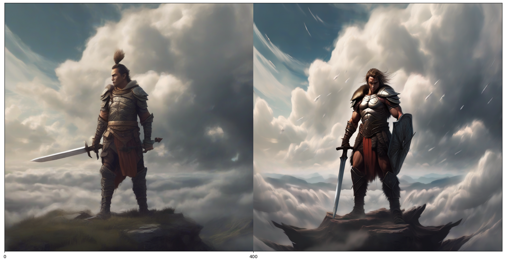
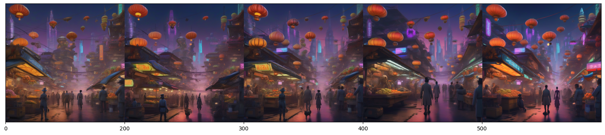

# DPO SDXL

This repository is based on the [*Diffusion Model Alignment Using Direct Preference Optimization*](https://arxiv.org/abs/2311.12908) method and the SDXL training code from the official huggingface examples. Note that this code is unofficial and may have issues, so please use it with caution.

# Experiment

