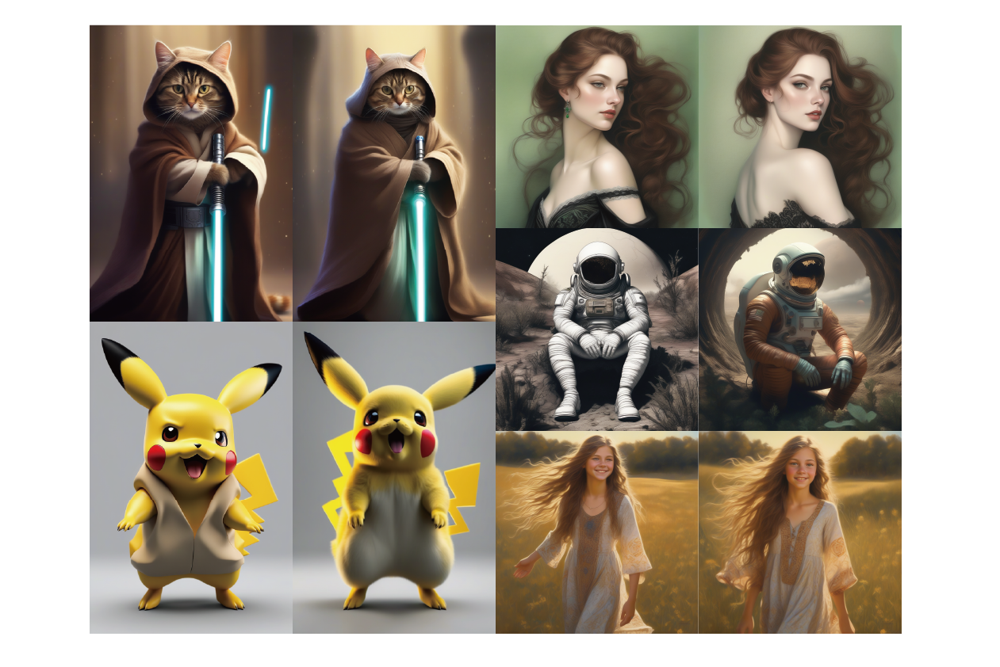
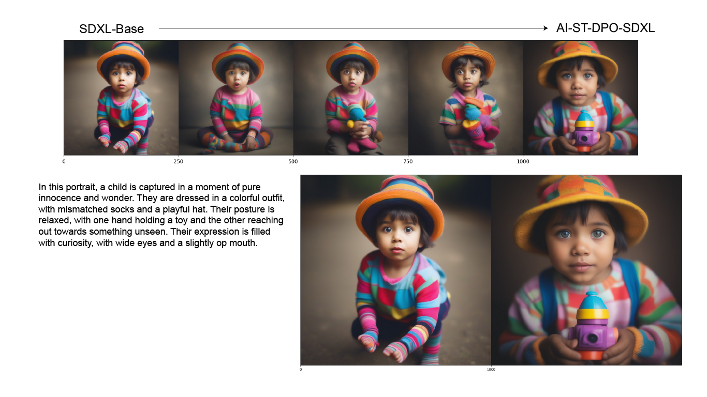
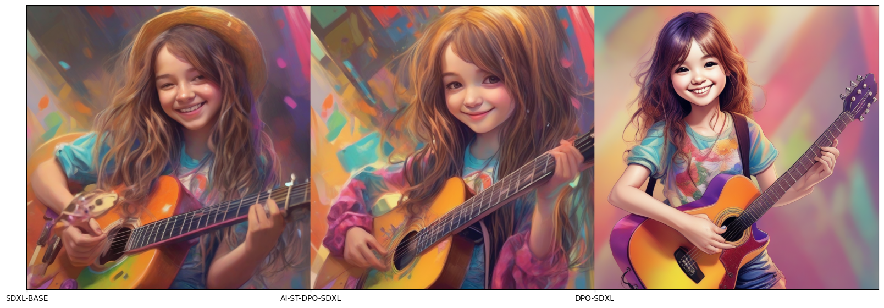

# AI Feedback-Based Self-Training Direct Preference Optimization


[](comming)
[](https://huggingface.co/chestnutlzj/ai-self-training-dpo-sdxl)
[](https://hits.seeyoufarm.com)                    




# Dataset Details

```
Num examples = 37180
Num Epochs = 3
```

# Compared To Human Feedback Model



Our model tends to perform closer to the SDXL-Base, but with optimized image details. The model provided in the original paper exhibits better color and detail performance, more in line with human preferences.
This also reflects a characteristic of using self-training to train the original model: it can optimize according to AI preferences while ensuring the capabilities of the original model. Training based on human preference data will make the output quality closely related to the human preference dataset.

# Acknowledgement

This work is based on the [*Diffusion Model Alignment Using Direct Preference Optimization*](https://arxiv.org/abs/2311.12908) method.